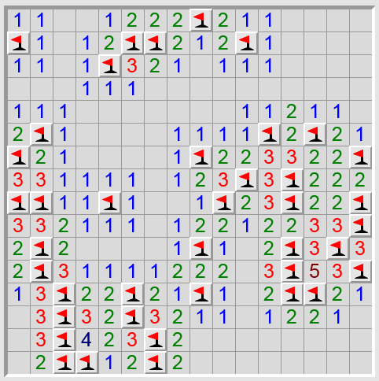

# minesweeper

## Regeln

Es gibt drei Standardspielfeldern mit unterschiedlicher Schwierigkeitsstufe.

- Anfänger: 81 Felder, 10 Minen oder 35 Minen
- Fortgeschrittene: 256 Felder, 40 Minen oder 99 Minen
- Profis: 484 Felder, 99 Minen oder 170 Minen

Alternativ kann man auch ein benutzerdefiniertes Spielfeld mit einer 
benutzerdefinierten Anzahl von Minen erstellen.

Der Spieler wählt ein Feld, das er aufdecken oder markieren möchte.
Ein aufgedecktes Feld ist entweder leer, hat eine Zahl oder eine Bombe dahinter.
- Leer bedeutet das Spiel geht einfach weiter
- Zahl bedeutet das Spiel geht auch weiter aber der Spieler kann erkennen wie viele Bomben auf den umliegenden 8 Feldern sind
- Bombe bedeutet das Spiel ist beendet

Ziel des Spiels ist es alle Felder ohne Bomben aufzudecken und alle Felder mit 
Bomben markiert zu haben.

## Meine Version

Da ich kein Künstler bin, soll meine Version vollständig in der Konsole ablaufen.
Der Spielablauf ist somit:
- Die Karte wird in die Konsole geprinted
- Der Spieler tippt eine Feldnummer und eine Aktion ein
- Die Karte wird verändert und erneut geprinted, oder das Spiel ist beendet

## Implementierung

Das Feld ist ein 2D Array mit fixer Länge, bzw mit einer Länge, die am Start
festgelegt werden kann.
Jedes Feld hat einen Wert von 0-11
- 0-8, zeigt an viele Bomben auf den Benachbarten Feldern sind und werden auch so angezeigt
- 9, ist die interne Bezeichnung für eine Bombe
- 10, dargestellt durch ein X zeigt ein markiertes Feld
- 11, dargestellt durch ein ? zeigt ein unbekanntes Feld
- 12, dargestellt durch ein B zeigt eine Bombe, die ausgelöst wurde

Gezählt wird im Array dabei von oben links nach unten und rechts:
<pre>
0,0     0,1     0,2     0,3
1,0     1,1     1,2     1,3
2,0     2,1     2,2     ...
</pre>

Aussehen der Ränder:

<pre>
  | 0 1 2 3 4 5 6 ...
- / - - - - - - - 
0 | ? ? ? ? ? ? ? 
1 | ? ? ? ? ? ? ? 
2 | ? ? ? ? ? ? ? 
3 | ? ? ? ? ? ? ? 
4 | ? ? ? ? ? ? ? 
</pre>